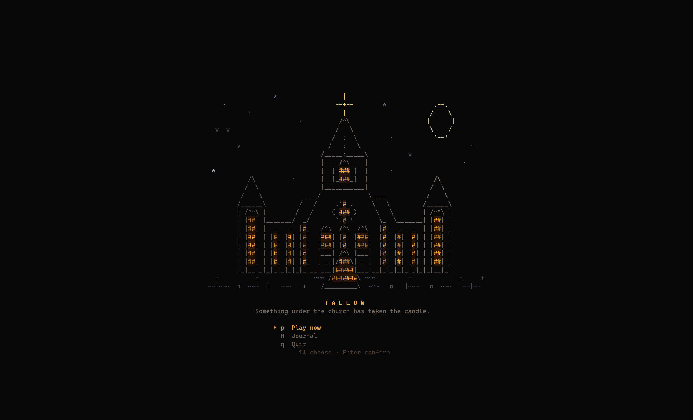
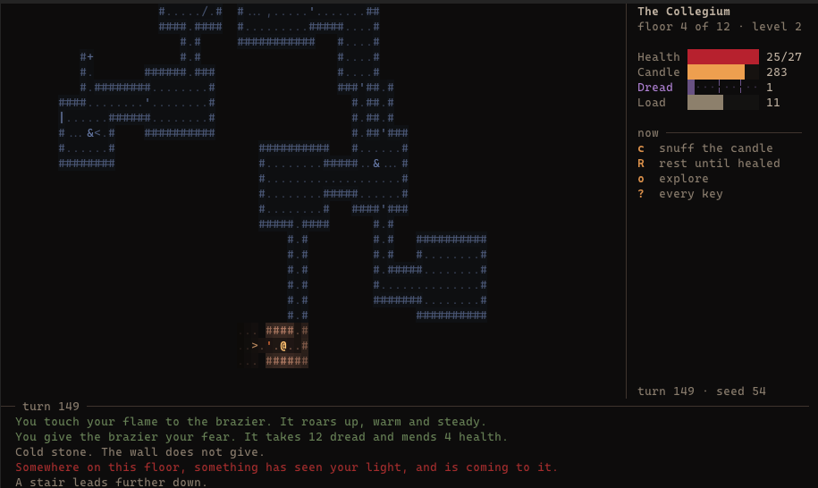

<div align="center">

# 🕯️ Tallow

**A dark-academia roguelike for the terminal.**
*Something under the church has taken the candle.*



</div>

---

Something is wrong with the Church of the Low Bell. The clergy dream the same dream and stop waking. Under the floorboards behind the altar there is a passage, and it keeps going down.

You go down with a candle. That candle is your light, and it is also your clock: every turn it burns, and the tallow to feed it doesn't lie around waiting for you. You get it from what you kill. 🩸

There's no character creation. Press a key and you're in the crypt. Your build is whatever you end up doing: the weapon you keep using, the rites you choose to remember, how long you dare to walk in the dark.

<div align="center">

<br>
<sub>Floor 4, the Collegium. Your candle lights a small circle; everything you've already seen fades to blue. The sidebar suggests the keys that matter right now.</sub>
</div>

## 🌑 Light and dark

Every decision in Tallow comes back to one question: **light the candle, or don't?**

- 🕯️ **Light** lets you see and fight well, but it burns tallow, and things see it from far off. Burn it long enough on one floor and something new comes looking for you.
- 🌘 **Darkness** saves tallow and lets you slip past things. It is also where **dread** gathers, and dread is what you pay for rites. But in the dark you strike worse, they strike harder, and some things only show themselves there.
- 😨 **Dread** is power with a cost. Hold a lot and your rites grow stronger. Hold too much and you start seeing things that aren't there, then **Nightmares** come for you, and at the very top your fear takes your face and walks.

## ⚔️ What you'll run into

- **Four factions that hate each other as much as they hate you.** Swarms flank you and quicken in the dark. The Taken were people once, and hold back in your light. The Remnant guard their posts. The Dreaming are barely there until light pins them down.
- **Weapons with personality.** A sickle leaves wounds that keep bleeding. A censer spills coals. A boathook hauls things in. A verger's staff shoves them into whatever is behind them. And no weapon works on everything.
- **Bodies are a choice.** Study one to learn its kind's secrets (and maybe a rite), or render it down for tallow. You can't do both.
- **Rites, not spells.** Sixteen of them, none of which just do damage: bind a creature to your will, swap places with it, seal a door, send your dread into something else. Your mind only holds a few at once.
- **Leavings.** Strange objects where reality broke, each with its own rule and its own price. Carry two at most.
- **Twelve floors down, four back up.** At the bottom waits the one who took the candle. Getting out with it is the hard part. 🪰

## ▶️ Play

### 🕯️ In your browser

Play it on **[itch.io](https://markomoth.itch.io/tallow-a-dark-fantasy-roguelike)**. It's the same game, played with the keyboard. Your run and your journal are kept in that browser.

### 📦 Download

Grab the latest build for Linux, Windows or macOS from **[Releases](https://github.com/markomoth/tallow/releases/latest)**, unpack it, and run `tallow` in a terminal that's at least **100×30**. The release page explains the one-time "unverified app" warning on macOS and Windows.

### 🦀 Or build it yourself

You'll need [Rust](https://rustup.rs):

```sh
cargo run --release
```

A few useful flags:

```sh
cargo run --release -- --seed 42   # play (or replay) a particular dungeon
cargo run --release -- --simple    # plain colors, your terminal's own background, no animation
```

`--simple` is for terminals without truecolor, light themes, transparent backgrounds, screen readers or recordings. It uses only the 16 standard colors, leaves the background to your terminal, and only redraws when you press a key.

Quitting mid-run saves it, and the next launch picks up where you left off. Whatever you learn across runs goes into your **journal** 📖.

## ⌨️ Keys

| Key | What it does |
|---|---|
| arrows · `hjkl` · numpad | Move (walk into things to fight, open, ring, light) |
| `yubn` | Move diagonally |
| Shift + direction | Run |
| `o` | Auto-explore |
| `.` · `R` | Wait a turn · rest until healed |
| `c` · `C` | Snuff or light your candle · shut doors beside you |
| `g` · `i` | Pick up · pack |
| `t` · `f` | Throw · fire a sling or crossbow |
| `s` | Study or render the body underfoot |
| `z` | Rites: ↑↓ to read one, a letter or Enter to cast |
| `S` + direction | Shove a creature back |
| `G` | Guard: wait braced and answer every miss |
| `>` · `<` | Down the stairs · up, once you carry the Vigil Candle |
| `F` | Flare the Vigil Candle (on the way back up) |
| `x` | Look: a card beside the creature (Tab cycles through them) |
| `@` · `M` · `?` | Your character · the journal · help |
| `q` | Save and quit |

## 🛠️ For the curious

Tallow is written in Rust with [ratatui](https://ratatui.rs). The game itself is a pure, deterministic library (`tallow-core`): the same seed and the same keypresses always play out the same way. That's also how saves work, and it's how `tallow-sim`, a headless bot, can play hundreds of runs to look for softlocks and check the balance.

The design document and the milestone log live in [`BUILD_GUIDE.md`](BUILD_GUIDE.md).

```sh
cargo test --workspace                     # all the tests
cargo run --release -p tallow-sim -- 500   # watch a bot play 500 runs
cd crates/tallow-web && trunk serve        # the browser version, at localhost:8080
```
